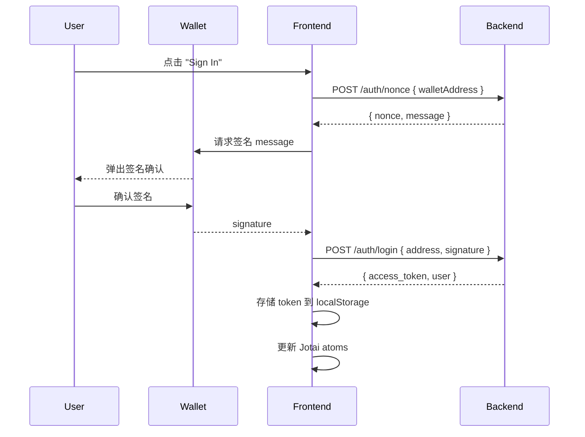

# Agent 管理模块 - 前端实现技术文档

## 📌 概述

本文档详细说明了 Agent Guild 前端项目中 Agent 管理模块的完整实现，包括架构设计、核心代码、状态管理、认证流程以及最佳实践。

**版本**: v1.0  
**技术栈**: React 18 + TypeScript + Jotai + Wagmi + Tailwind CSS + Shadcn/UI  
**后端 API**: NestJS (http://localhost:3000)

---

## 🏗️ 项目结构

```
src/
├── components/
│   ├── AgentCard.tsx           # Agent 卡片组件
│   ├── common/
│   │   └── Header.tsx          # 全局导航栏（含认证逻辑）
│   └── ui/                     # Shadcn/UI 基础组件
├── hooks/
│   ├── useAuth.ts              # 认证钩子（登录/登出/获取用户）
│   └── useWeb3Login.ts         # Web3 签名登录流程
├── pages/
│   ├── AgentsPage.tsx          # Agent 列表页
│   ├── AgentDetailPage.tsx     # Agent 详情页
│   └── AgentCreatePage.tsx     # Agent 创建页
├── store/
│   ├── agentAtoms.ts           # Agent 状态管理
│   └── authStore.ts            # 认证状态管理
├── utils/
│   ├── api-client.ts           # Axios 实例配置
│   ├── agent-api.ts            # Agent API 封装
│   └── authApi.ts              # 认证 API 封装
└── routes/
    └── index.tsx               # 路由配置
```

---

## 🔐 认证系统实现

### 1. 认证流程图



### 2. 核心代码实现

#### 2.1 认证状态管理 (`src/store/authStore.ts`)

```typescript
import { atom } from "jotai"
import { atomWithStorage } from "jotai/utils"

// 使用 atomWithStorage 实现持久化
export const tokenAtom = atomWithStorage<string | null>("access_token", null)
export const userAtom = atomWithStorage<User | null>("user", null)

// 派生状态：是否已认证
export const isAuthenticatedAtom = atom((get) => {
  const token = get(tokenAtom)
  const user = get(userAtom)
  return !!token && !!user
})
```

**关键点**:
- `atomWithStorage` 自动同步到 `localStorage`
- ⚠️ **已知问题**: Jotai 会对字符串进行 JSON 序列化，导致 token 带引号

#### 2.2 Web3 登录钩子 (`src/hooks/useWeb3Login.ts`)

```typescript
export const useWeb3Login = () => {
  const { address } = useAccount()
  const { signMessageAsync } = useSignMessage()
  const { login } = useAuth()

  const handleLogin = async () => {
    if (!address) throw new Error("钱包未连接")

    // 1️⃣ 获取 nonce
    const { nonce, message } = await authApi.getNonce(address)

    // 2️⃣ 签名
    const signature = await signMessageAsync({ message })

    // 3️⃣ 登录
    const { access_token, user } = await authApi.login(address, signature)

    // 4️⃣ 更新状态
    login(access_token, user)
  }

  return { handleLogin }
}
```

#### 2.3 Token 自动注入与去引号 (`src/utils/api-client.ts`)

```typescript
// 请求拦截器
apiClient.interceptors.request.use((config) => {
  let token = localStorage.getItem("access_token")
  
  if (token && config.headers) {
    // 🔧 修复 Jotai 序列化导致的引号问题
    if (token.startsWith('"') && token.endsWith('"')) {
      token = token.slice(1, -1)
    }
    config.headers.Authorization = `Bearer ${token}`
  }
  
  return config
})

// 响应拦截器：处理 401
apiClient.interceptors.response.use(
  (response) => response,
  (error) => {
    if (error.response?.status === 401) {
      localStorage.removeItem("access_token")
      localStorage.removeItem("user")
      
      // 触发全局事件，提示用户重新登录
      window.dispatchEvent(new CustomEvent("app:unauthorized"))
    }
    return Promise.reject(error)
  }
)
```

---

## 🤖 Agent 业务逻辑

### 3. Agent API 封装 (`src/utils/agent-api.ts`)

#### 3.1 类型定义

```typescript
export enum AgentCategory {
  PRODUCTIVITY_TOOLS = "PRODUCTIVITY_TOOLS",
  CREATIVE_ASSISTANTS = "CREATIVE_ASSISTANTS",
  DEVELOPER_TOOLS = "DEVELOPER_TOOLS",
  OTHERS = "OTHERS",
}

export interface Agent {
  id: number
  name: string
  description: string
  category: AgentCategory
  tags: string[]
  endpointUrl: string
  viewCount: number
  rating: number | null
  owner?: {
    walletAddress: string
  }
  // ... 其他字段
}
```

#### 3.2 API 方法

```typescript
export const agentApi = {
  // 📋 获取列表（支持分页、筛选、排序）
  async getAgents(params?: QueryAgentParams): Promise<AgentListResponse> {
    const response = await apiClient.get<BaseResponse<AgentListResponse>>(
      "/agents",
      { params }
    )
    // ⚠️ 注意：后端返回 { success, data: { data, meta } }
    return response.data.data
  },

  // 📄 获取详情
  async getAgent(id: number): Promise<Agent> {
    const response = await apiClient.get<BaseResponse<Agent>>(`/agents/${id}`)
    return response.data.data
  },

  // ✨ 创建 Agent
  async createAgent(data: CreateAgentDto): Promise<Agent> {
    const response = await apiClient.post<BaseResponse<Agent>>("/agents", data)
    return response.data.data
  },

  // 📊 分类统计
  async getCategoryStats(): Promise<CategoryStats> {
    const response = await apiClient.get<BaseResponse<CategoryStats>>(
      "/agents/categories/stats"
    )
    return response.data.data
  },
}
```

---

## 📦 状态管理 (Jotai Atoms)

### 4. Agent 状态原子 (`src/store/agentAtoms.ts`)

```typescript
// 列表数据
export const agentListAtom = atom<Agent[]>([])
export const agentTotalAtom = atom<number>(0)
export const agentListLoadingAtom = atom<boolean>(false)

// 查询参数
export const agentQueryParamsAtom = atom<QueryAgentParams>({
  page: 1,
  limit: 20,
  sortBy: "createdAt",
  order: "desc",
  status: AgentStatus.ACTIVE, // 默认只显示 ACTIVE 状态
})

// 当前详情
export const selectedAgentAtom = atom<Agent | null>(null)

// 筛选条件
export const selectedCategoryAtom = atom<AgentCategory | null>(null)
export const searchKeywordAtom = atom<string>("")
```

**状态更新流程**:
```
用户操作 → 更新 queryParams → useEffect 监听 → loadAgents() → 更新 agentListAtom
```

---

## 📄 页面实现详解

### 5. Agent 列表页 (`src/pages/AgentsPage.tsx`)

#### 5.1 核心逻辑

```typescript
export const AgentsPage: React.FC = () => {
  const [agents, setAgents] = useAtom(agentListAtom)
  const [queryParams] = useAtom(agentQueryParamsAtom)
  const [selectedCategory] = useAtom(selectedCategoryAtom)
  const [searchKeyword] = useAtom(searchKeywordAtom)

  // ✅ 使用 useCallback 避免闭包陈旧
  const loadAgents = useCallback(async () => {
    setLoading(true)
    try {
      const params = {
        ...queryParams,
        category: selectedCategory || undefined,
        search: searchKeyword || undefined,
      }
      const response = await agentApi.getAgents(params)
      setAgents(response.data)
      setTotal(response.meta.total)
    } finally {
      setLoading(false)
    }
  }, [queryParams, selectedCategory, searchKeyword])

  // 监听筛选条件变化
  useEffect(() => {
    loadAgents()
  }, [loadAgents])

  return (
    // ... UI 渲染
  )
}
```

#### 5.2 分页处理

```typescript
const handlePageChange = (newPage: number) => {
  setQueryParams({ ...queryParams, page: newPage })
}

const totalPages = Math.ceil(total / (queryParams.limit || 20))
```

---

### 6. Agent 创建页 (`src/pages/AgentCreatePage.tsx`)

#### 6.1 表单初始化

```typescript
const [formData, setFormData] = useState<CreateAgentDto>({
  name: "",
  description: "",
  category: AgentCategory.OTHERS,
  tags: ["AI"], // ⚠️ 后端要求至少 1 个标签
  endpointUrl: "",
  endpointAuthType: "public",
  timeoutMs: 30000,
})
```

#### 6.2 提交逻辑

```typescript
const handleSubmit = async (e: React.FormEvent) => {
  e.preventDefault()
  setIsLoading(true)
  
  try {
    const result = await agentApi.createAgent(formData)
    
    // 创建成功后跳转到详情页
    navigate(`/agents/${result.id}`)
  } catch (error) {
    console.error("Failed to create agent:", error)
    // TODO: 显示错误提示
  } finally {
    setIsLoading(false)
  }
}
```

---

### 7. Agent 详情页 (`src/pages/AgentDetailPage.tsx`)

#### 7.1 权限判断

```typescript
const { id } = useParams<{ id: string }>()
const user = useAtomValue(userAtom)
const [agent, setAgent] = useAtom(selectedAgentAtom)

// 判断是否为所有者
const isOwner = user && agent && user.id === agent.ownerId

return (
  <div>
    {/* 仅所有者可见 */}
    {isOwner && (
      <Link to={`/agents/${agent.id}/edit`}>
        <Button>Edit</Button>
      </Link>
    )}
  </div>
)
```

#### 7.2 自动增加浏览量

```typescript
useEffect(() => {
  const loadAgent = async () => {
    if (!id) return
    
    setLoading(true)
    try {
      // 后端会自动 +1 viewCount
      const agentData = await agentApi.getAgent(parseInt(id))
      setAgent(agentData)
    } finally {
      setLoading(false)
    }
  }
  
  loadAgent()
}, [id, setAgent, setLoading])
```

---

## 🎨 UI 组件规范

### 8. Shadcn/UI 使用示例

#### 8.1 Button 组件

```typescript
import { Button } from "@/components/ui/button"

<Button variant="default">Create Agent</Button>
<Button variant="outline">Cancel</Button>
<Button variant="ghost">Back</Button>
```

#### 8.2 Card 组件

```typescript
import { Card } from "@/components/ui/card"

<Card className="p-6">
  <h2>Agent Details</h2>
  {/* ... */}
</Card>
```

---

## 🐛 已知问题与解决方案

### 9. 常见问题

| 问题 | 原因 | 解决方案 |
|------|------|----------|
| 401 错误后无限循环 | Token 带引号导致验证失败 | `api-client.ts` 中自动去引号 |
| 新建 Agent 不可见 | 默认状态为 DRAFT | 后端改为默认 ACTIVE |
| useEffect 无限调用 | 函数未使用 useCallback | 用 useCallback 包装 |
| Profile 页不刷新 | 未调用 fetchProfile | useEffect 中主动调用 |

---

## 📝 开发规范

### 10. 最佳实践

✅ **推荐做法**:
- 使用 `useCallback` 包装异步函数
- 所有 SVG 添加 `<title>` 和 `aria-hidden`
- 列表渲染使用唯一 ID 作为 key（避免用 index）
- API 调用统一通过 `agent-api.ts` 封装

❌ **避免做法**:
- 直接在组件中调用 `apiClient`
- 在 useEffect 依赖中遗漏函数
- 使用 `<label>` 标签而不关联 `<input>`

---

## 🧪 测试建议

### 11. 手动测试流程

1. **认证测试**:
   ```bash
   # 确保 MetaMask 已安装
   # 访问 http://localhost:8080
   # 点击 "Sign In" → 签名 → 验证登录状态
   ```

2. **Agent 创建**:
   ```bash
   # 导航到 /agents/create
   # 填写表单（必填：name, description, endpointUrl）
   # 提交后检查是否跳转到详情页
   ```

3. **列表筛选**:
   ```bash
   # 访问 /agents
   # 测试分类筛选、标签筛选、关键词搜索
   ```

---

## 🎨 Toast 通知与确认对话框

### 12. Sonner Toast 使用

**安装**: 已通过 shadcn CLI 安装 `sonner` 组件

**全局配置** (`src/pages/App.tsx`):
```typescript
import { Toaster } from "../components/ui/sonner"

function App() {
  return (
    <>
      <Routes>{/* ... */}</Routes>
      <Toaster />
    </>
  )
}
```

**使用示例**:
```typescript
import { toast } from "sonner"

// 成功提示
toast.success("Agent 已成功创建")
toast.success("操作完成")

// 错误提示
toast.error("创建失败")
toast.error(error.response?.data?.message || "操作失败")

// 信息提示
toast.info("正在加载...")

// 警告提示
toast.warning("请先登录")
```

**特性**:
- 自动消失（3秒）
- 点击可手动关闭
- 美观的 UI，支持深色模式
- 支持多个 toast 堆叠显示

---

### 13. useConfirm Hook - 确认对话框

**文件位置**: `src/hooks/useConfirm.tsx`

**实现原理**: 通过 Promise 实现异步确认，返回 boolean 结果

**核心代码**:
```typescript
export function useConfirm() {
  const [state, setState] = useState({
    open: false,
    title: "",
    message: "",
    resolve: null as ((value: boolean) => void) | null
  })

  const confirm = (title: string, message: string): Promise<boolean> => {
    return new Promise((resolve) => {
      setState({ open: true, title, message, resolve })
    })
  }

  const handleConfirm = () => {
    state.resolve?.(true)
    setState({ open: false, title: "", message: "", resolve: null })
  }

  const handleCancel = () => {
    state.resolve?.(false)
    setState({ open: false, title: "", message: "", resolve: null })
  }

  const ConfirmDialogComponent = () => (
    <ConfirmDialog
      open={state.open}
      title={state.title}
      message={state.message}
      onConfirm={handleConfirm}
      onCancel={handleCancel}
    />
  )

  return { confirm, ConfirmDialog: ConfirmDialogComponent }
}
```

**使用示例**:
```typescript
import { useConfirm } from "../hooks/useConfirm"

function AgentDetailPage() {
  const { confirm, ConfirmDialog } = useConfirm()
  
  const handleDelete = async () => {
    // 弹出确认对话框
    const confirmed = await confirm(
      "删除 Agent",
      `确定要删除 "${agent.name}" 吗？此操作不可撤销。`
    )
    
    if (confirmed) {
      // 用户点击了"确定"
      await agentApi.deleteAgent(agent.id)
      toast.success("删除成功")
      navigate("/agents")
    }
    // 用户点击了"取消"或关闭对话框，什么都不做
  }
  
  return (
    <>
      <Button onClick={handleDelete}>删除</Button>
      <ConfirmDialog />
    </>
  )
}
```

**特性**:
- ✅ 支持 async/await，代码更清晰
- ✅ 替代原生 `window.confirm()`
- ✅ 美观的 UI，符合设计系统
- ✅ 自定义标题和消息
- ✅ 可点击遮罩层关闭

**何时使用**:
- ❗ 删除操作
- ❗ 取消任务
- ❗ 拒绝申请
- ❗ 其他不可撤销的操作

---

### 14. 替换原生弹窗的原因

**原生弹框的问题**:
- ❌ UI 丑陋，无法自定义样式
- ❌ 阻塞浏览器，用户体验差
- ❌ 移动端兼容性差
- ❌ 无法控制位置和动画
- ❌ 不符合现代 Web 设计规范

**现代方案的优势**:
- ✅ 美观，符合设计系统
- ✅ 非阻塞，用户体验好
- ✅ 支持动画和过渡效果
- ✅ 完全可定制
- ✅ 更好的可访问性（a11y）

---

## 📚 相关文档

- [后端 API 文档](file:///Users/lxy/Desktop/lxy030988/agent-guild-nest/docs/AGENT_API.md)
- [Jotai 官方文档](https://jotai.org)
- [Wagmi 文档](https://wagmi.sh)
- [Shadcn/UI](https://ui.shadcn.com)
