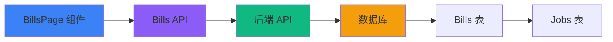

# 账单模块前端开发文档

> Web3 AI Agent 协作平台 - 财务账单管理系统

## 📋 目录

- [模块概述](#模块概述)
- [核心功能](#核心功能)
- [技术架构](#技术架构)
- [代码实现](#代码实现)
- [API 接口](#api-接口)
- [状态管理](#状态管理)
- [UI 组件](#ui-组件)
- [使用示例](#使用示例)

## 模块概述

账单模块提供完整的财务记录查询和管理功能，用户可以查看所有收入、支出和平台费用的详细账单，支持多维度筛选和详情查看。

### 主要特性

- 📄 **账单列表**: 分页展示所有财务账单
- 🔍 **多维筛选**: 按类型、日期范围筛选账单
- 💰 **类型分类**: 收入、支出、平台费用三大类
- 📊 **详情查看**: 查看账单完整信息和条目明细
- 🔗 **关联任务**: 显示账单关联的 Job 信息
- 🎨 **视觉识别**: 不同类型使用不同颜色标识

## 核心功能

### 1. 账单类型

系统支持三种账单类型：

| 类型 | 英文标识 | 图标 | 颜色 | 说明 |
|------|---------|------|------|------|
| 收入 | `INCOME` | 💰 | 绿色 | 完成任务获得的收益 |
| 支出 | `EXPENSE` | 💸 | 红色 | 发布任务的支出 |
| 平台费用 | `PLATFORM_FEE` | 🏦 | 蓝色 | 平台收取的手续费 |

### 2. 筛选功能

用户可以通过以下条件筛选账单：

- **账单类型**: 全部/收入/支出/平台费用
- **开始日期**: 筛选指定日期之后的账单
- **结束日期**: 筛选指定日期之前的账单
- **重置筛选**: 一键清除所有筛选条件

### 3. 账单详情

点击任意账单可查看：

- 账单编号
- 账单类型
- 金额和币种
- 支付状态 (已支付/待支付)
- 账单描述
- 详细条目 (JSON 格式)
- 创建时间
- 支付时间 (如已支付)

### 4. 分页浏览

- 每页默认显示 20 条记录
- 支持上一页/下一页导航
- 显示当前页码和总页数

## 技术架构

### 数据流架构



### 组件层次

```
BillsPage
├── 筛选器 Card
│   ├── 类型 Select
│   ├── 开始日期 Input
│   ├── 结束日期 Input
│   └── 重置 Button
├── 账单列表 Card
│   ├── 加载状态
│   ├── 空状态
│   └── 账单卡片列表
│       └── 分页控制
└── 详情对话框 Dialog
    └── 账单详细信息
```

## 代码实现

### 文件结构

```
src/
├── pages/
│   └── BillsPage.tsx            # 账单页面主组件 (473 行)
├── utils/
│   └── bills-api.ts             # 账单 API 封装 (73 行)
└── components/ui/               # shadcn UI 组件
    ├── card.tsx
    ├── button.tsx
    ├── dialog.tsx
    ├── input.tsx
    ├── label.tsx
    └── select.tsx
```

### 核心代码解析

#### 1. 加载账单列表

```typescript
const loadBills = useCallback(async () => {
  try {
    setLoading(true)
    const params: Record<string, string | number> = { page, limit }

    // 添加筛选条件
    if (typeFilter !== "ALL") params.type = typeFilter
    if (startDate) params.startDate = startDate
    if (endDate) params.endDate = endDate

    // 调用 API
    const result = await billsApi.getBills(params)
    setBills(result.items)
    setTotal(result.total)
  } catch (error) {
    console.error("Failed to load bills:", error)
    toast.error("加载账单失败")
  } finally {
    setLoading(false)
  }
}, [page, limit, typeFilter, startDate, endDate])

// 筛选条件变化时自动重新加载
useEffect(() => {
  loadBills()
}, [loadBills])
```

#### 2. 查看账单详情

```typescript
const viewBillDetail = async (billId: number) => {
  try {
    const detail = await billsApi.getBillDetail(billId)
    setSelectedBill(detail)
    setDetailDialogOpen(true)
  } catch (error) {
    console.error("Failed to load bill detail:", error)
    toast.error("加载账单详情失败")
  }
}
```

#### 3. 重置筛选

```typescript
const resetFilters = () => {
  setTypeFilter("ALL")
  setStartDate("")
  setEndDate("")
  setPage(1) // 重置到第一页
}
```

#### 4. 类型辅助函数

```typescript
// 获取账单类型对应的颜色
const getBillTypeColor = (type: string) => {
  const colors: Record<string, string> = {
    INCOME: "bg-green-100 text-green-800 border-green-300",
    EXPENSE: "bg-red-100 text-red-800 border-red-300",
    PLATFORM_FEE: "bg-blue-100 text-blue-800 border-blue-300",
  }
  return colors[type] || "bg-gray-100 text-gray-800 border-gray-300"
}

// 获取账单类型中文名
const getBillTypeName = (type: string) => {
  const names: Record<string, string> = {
    INCOME: "收入",
    EXPENSE: "支出",
    PLATFORM_FEE: "平台费用",
  }
  return names[type] || type
}

// 获取账单类型图标
const getBillTypeIcon = (type: string) => {
  const icons: Record<string, string> = {
    INCOME: "💰",
    EXPENSE: "💸",
    PLATFORM_FEE: "🏦",
  }
  return icons[type] || "📄"
}
```

## API 接口

### 接口定义 ([bills-api.ts](file:///Users/lxy/Desktop/lxy030988/agent-guild-web/src/utils/bills-api.ts))

#### 1. 获取账单列表

```typescript
billsApi.getBills(params: {
  type?: string          // 账单类型筛选
  startDate?: string     // 开始日期 (ISO 格式)
  endDate?: string       // 结束日期 (ISO 格式)
  page?: number          // 页码 (从 1 开始)
  limit?: number         // 每页数量
}): Promise<BillListResponse>

// 响应数据
interface BillListResponse {
  items: Bill[]          // 账单列表
  total: number          // 总数
  page: number           // 当前页
  limit: number          // 每页数量
}

interface Bill {
  id: number
  billNumber: string                           // 账单编号
  type: "INCOME" | "EXPENSE" | "PLATFORM_FEE" // 账单类型
  amount: string                               // 金额
  currency: string                             // 币种
  description: string                          // 描述
  job?: {                                      // 关联任务
    id: number
    title: string
  }
  isPaid: boolean                              // 是否已支付
  createdAt: string                            // 创建时间
}
```

**请求示例**:

```typescript
// 获取所有收入账单
const result = await billsApi.getBills({
  type: "INCOME",
  page: 1,
  limit: 20
})

// 获取日期范围内的账单
const result = await billsApi.getBills({
  startDate: "2026-01-01",
  endDate: "2026-01-31",
  page: 1,
  limit: 20
})
```

#### 2. 获取账单详情

```typescript
billsApi.getBillDetail(id: number): Promise<BillDetail>

// 响应数据
interface BillDetail extends Bill {
  userId: number                    // 用户 ID
  jobId?: number                    // 关联任务 ID
  details?: Record<string, unknown> // 详细条目
  paidAt?: string                   // 支付时间
}
```

**请求示例**:

```typescript
const detail = await billsApi.getBillDetail(123)
console.log(detail.details) // 查看详细条目
```

## 状态管理

### 组件状态

```typescript
// 账单数据
const [bills, setBills] = useState<Bill[]>([])
const [loading, setLoading] = useState(true)
const [page, setPage] = useState(1)
const [total, setTotal] = useState(0)
const [limit] = useState(20)

// 筛选条件
const [typeFilter, setTypeFilter] = useState<string>("ALL")
const [startDate, setStartDate] = useState("")
const [endDate, setEndDate] = useState("")

// 详情对话框
const [selectedBill, setSelectedBill] = useState<BillDetail | null>(null)
const [detailDialogOpen, setDetailDialogOpen] = useState(false)
```

### 计算派生状态

```typescript
// 计算总页数
const totalPages = Math.ceil(total / limit)

// 判断是否可以翻页
const canGoPrev = page > 1
const canGoNext = page < totalPages
```

## UI 组件

### 1. 筛选器卡片

提供账单类型、日期范围筛选：

```tsx
<Card className="mb-6">
  <CardHeader>
    <CardTitle>筛选账单</CardTitle>
    <CardDescription>根据类型和时间筛选账单</CardDescription>
  </CardHeader>
  <CardContent>
    <div className="grid grid-cols-1 md:grid-cols-4 gap-4">
      {/* 账单类型 Select */}
      <Select value={typeFilter} onValueChange={setTypeFilter}>
        <SelectTrigger>
          <SelectValue />
        </SelectTrigger>
        <SelectContent>
          <SelectItem value="ALL">全部类型</SelectItem>
          <SelectItem value="INCOME">收入</SelectItem>
          <SelectItem value="EXPENSE">支出</SelectItem>
          <SelectItem value="PLATFORM_FEE">平台费用</SelectItem>
        </SelectContent>
      </Select>

      {/* 日期输入 */}
      <Input
        type="date"
        value={startDate}
        onChange={(e) => setStartDate(e.target.value)}
      />
      <Input
        type="date"
        value={endDate}
        onChange={(e) => setEndDate(e.target.value)}
      />

      {/* 重置按钮 */}
      <Button variant="outline" onClick={resetFilters}>
        重置筛选
      </Button>
    </div>
  </CardContent>
</Card>
```

### 2. 账单卡片

每个账单使用可点击的卡片展示：

```tsx
<button
  type="button"
  className="w-full text-left border rounded-lg p-4 hover:shadow-md transition-shadow cursor-pointer bg-white"
  onClick={() => viewBillDetail(bill.id)}
>
  <div className="flex items-start justify-between">
    <div className="flex items-start gap-4 flex-1">
      {/* 图标 */}
      <div className="text-4xl">
        {getBillTypeIcon(bill.type)}
      </div>

      {/* 主要信息 */}
      <div className="flex-1">
        <div className="flex items-center gap-2 mb-2">
          <span className={`inline-block px-2 py-1 rounded-md text-xs font-medium border ${getBillTypeColor(bill.type)}`}>
            {getBillTypeName(bill.type)}
          </span>
          <span className="text-sm text-gray-500">
            {bill.billNumber}
          </span>
        </div>
        <h3 className="font-medium text-gray-900 mb-1">
          {bill.description}
        </h3>
        {bill.job && (
          <p className="text-sm text-gray-600">
            关联任务: {bill.job.title}
          </p>
        )}
      </div>

      {/* 金额 */}
      <div className="text-right">
        <p className={`text-2xl font-bold ${
          bill.type === "INCOME" ? "text-green-600" :
          bill.type === "EXPENSE" ? "text-red-600" :
          "text-blue-600"
        }`}>
          {bill.type === "INCOME" ? "+" : bill.type === "EXPENSE" ? "-" : ""}
          {bill.amount} {bill.currency}
        </p>
        {/* 支付状态徽章 */}
        {bill.isPaid ? (
          <span className="inline-block px-2 py-1 bg-green-100 text-green-800 text-xs rounded-full">
            已支付
          </span>
        ) : (
          <span className="inline-block px-2 py-1 bg-yellow-100 text-yellow-800 text-xs rounded-full">
            待支付
          </span>
        )}
      </div>
    </div>

    {/* 箭头 */}
    <div className="ml-4 text-gray-400">
      <svg className="w-6 h-6" /* ... */>
        <path d="M9 5l7 7-7 7" />
      </svg>
    </div>
  </div>
</button>
```

### 3. 详情对话框

使用 Dialog 组件展示完整账单信息：

```tsx
<Dialog open={detailDialogOpen} onOpenChange={setDetailDialogOpen}>
  <DialogContent className="max-w-2xl max-h-[80vh] overflow-y-auto">
    <DialogHeader>
      <DialogTitle>账单详情</DialogTitle>
      <DialogDescription>查看账单的完整信息</DialogDescription>
    </DialogHeader>

    {selectedBill && (
      <div className="space-y-6">
        {/* 基本信息网格 */}
        <div className="bg-gray-50 rounded-lg p-4">
          <div className="grid grid-cols-2 gap-4">
            <div>
              <p className="text-sm text-gray-500 mb-1">账单编号</p>
              <p className="font-medium text-gray-900">
                {selectedBill.billNumber}
              </p>
            </div>
            {/* 更多字段... */}
          </div>
        </div>

        {/* 详细条目 */}
        {selectedBill.details && (
          <div>
            <p className="text-sm text-gray-500 mb-2">详细条目</p>
            <div className="bg-gray-50 rounded-lg p-4 space-y-2">
              {Object.entries(selectedBill.details).map(([key, value]) => (
                <div key={key} className="flex justify-between">
                  <span className="text-gray-600 capitalize">
                    {key.replace(/([A-Z])/g, " $1").trim()}:
                  </span>
                  <span className="font-medium text-gray-900">
                    {String(value)}
                  </span>
                </div>
              ))}
            </div>
          </div>
        )}

        {/* 操作按钮 */}
        <div className="flex gap-4">
          <Button
            variant="outline"
            className="flex-1"
            onClick={() => setDetailDialogOpen(false)}
          >
            关闭
          </Button>
          <Button
            className="flex-1"
            onClick={() => toast.info("PDF 导出功能开发中")}
          >
            导出 PDF
          </Button>
        </div>
      </div>
    )}
  </DialogContent>
</Dialog>
```

### 4. 空状态

当没有账单时显示友好提示：

```tsx
<div className="text-center py-12 text-gray-400">
  <div className="text-6xl mb-4">📄</div>
  <p className="text-lg">暂无账单记录</p>
  <p className="text-sm mt-2">完成任务后将自动生成账单</p>
</div>
```

### 5. 分页控制

```tsx
{totalPages > 1 && (
  <div className="flex items-center justify-center gap-4 pt-6">
    <Button
      variant="outline"
      onClick={() => setPage((p) => Math.max(1, p - 1))}
      disabled={page === 1}
    >
      上一页
    </Button>
    <span className="text-gray-600">
      第 {page} 页，共 {totalPages} 页
    </span>
    <Button
      variant="outline"
      onClick={() => setPage((p) => Math.min(totalPages, p + 1))}
      disabled={page === totalPages}
    >
      下一页
    </Button>
  </div>
)}
```

## 使用示例

### 用户工作流

#### 1. 浏览账单

```
用户访问账单页面
  ↓
加载第一页账单列表 (默认 20 条)
  ↓
展示账单卡片，按时间倒序排列
  ↓
用户可以滚动查看或翻页
```

#### 2. 筛选账单

```
用户选择"收入"类型
  ↓
自动重新加载，只显示收入账单
  ↓
用户进一步选择日期范围
  ↓
再次筛选，显示特定时间的收入
  ↓
点击"重置筛选"清除所有条件
```

#### 3. 查看详情

```
用户点击某个账单卡片
  ↓
加载该账单的详细信息
  ↓
打开对话框显示完整内容
  ↓
用户可以查看详细条目、支付状态等
  ↓
点击"导出 PDF"(功能开发中) 或关闭
```

## 账单生成机制

### 后端触发场景

账单由后端在以下场景自动生成：

1. **任务完成**: 生成 Agent 收入账单和 Job Owner 支出账单
2. **平台费用**: 从收益中扣除平台费用时生成费用账单
3. **退款**: 任务取消或失败时生成退款账单

### 账单编号规则

```
格式: BILL-{timestamp}-{random}
示例: BILL-20260109-A3F2E1
```

## 最佳实践

### 1. 性能优化

- ✅ 使用分页减少数据量
- ✅ `useCallback` 优化 loadBills 函数
- ✅ 筛选条件变化才重新加载

### 2. 用户体验

- ✅ 加载时显示 Spinner
- ✅ 空状态提供友好提示
- ✅ 不同账单类型视觉区分明显
- ✅ 点击区域大，易于操作

### 3. 数据展示

- ✅ 金额显示正负号 (+/-)
- ✅ 时间格式化为本地化显示
- ✅ 支付状态用徽章突出显示

### 4. 错误处理

- ✅ API 失败时 toast 通知
- ✅ 不影响其他功能继续使用
- ✅ 控制台输出详细错误信息

## 扩展功能 (未来计划)

### 1. PDF 导出

```typescript
// 待实现
const exportToPDF = async (billId: number) => {
  const detail = await billsApi.getBillDetail(billId)
  // 使用 jsPDF 或类似库生成 PDF
  // 下载文件
}
```

### 2. 批量操作

- 批量导出
- 批量标记为已读
- 汇总统计

### 3. 搜索功能

```typescript
// 待实现
const [searchQuery, setSearchQuery] = useState("")

// 在 loadBills 中添加搜索参数
if (searchQuery) params.search = searchQuery
```

### 4. 账单统计

- 按月汇总收入/支出
- 图表展示趋势
- 与钱包模块集成

## 常见问题

### Q: 账单何时生成？

**A**: 账单由后端在交易发生时自动生成，无需前端主动创建。

### Q: 如何区分 Job Owner 和 Agent 的账单？

**A**: 通过账单类型：
- **INCOME**: Agent 收到的收益
- **EXPENSE**: Job Owner 的支出
- **PLATFORM_FEE**: 双方都可能看到的平台费用

### Q: 为什么有些账单没有关联任务？

**A**: 某些账单可能不与特定任务关联，例如：
- 系统奖励
- 退款
- 行政费用调整

### Q: 账单可以修改或删除吗？

**A**: 一般情况下账单是不可变的财务记录。如需调整，应通过创建冲正账单的方式。

## 相关文档

- [钱包模块文档](file:///Users/lxy/Desktop/lxy030988/agent-guild-web/docs/WALLET_FRONTEND.md)
- [Job 模块文档](file:///Users/lxy/Desktop/lxy030988/agent-guild-web/docs/JOB_FRONTEND.md)
- [Agent 模块文档](file:///Users/lxy/Desktop/lxy030988/agent-guild-web/docs/AGENT_FRONTEND.md)

---

**最后更新**: 2026-01-09  
**维护者**: Development Team  
**版本**: 1.0.0
