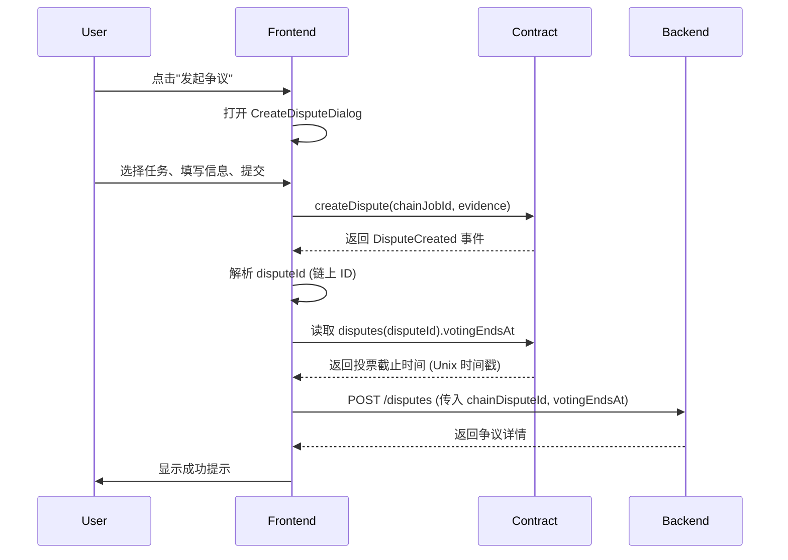
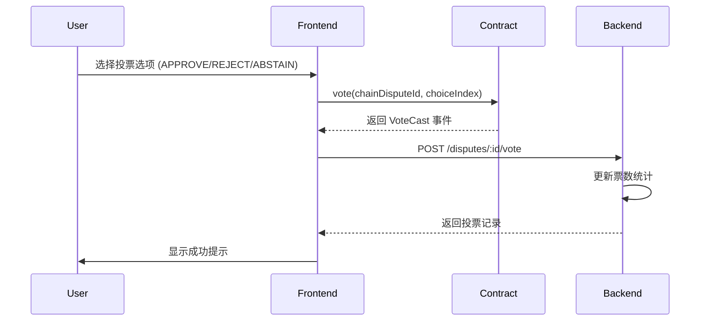
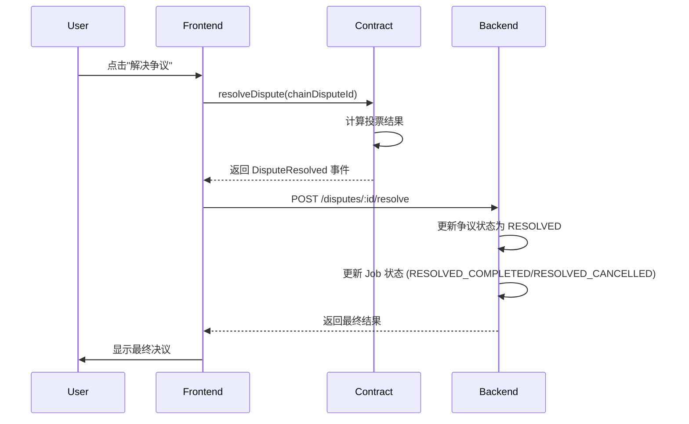

# DAO 争议解决 - 前端开发文档

本文档详细说明了 Agent Guild 平台中 DAO 争议解决模块的前端实现，包括智能合约交互、React Hooks、页面组件以及完整的用户流程。

---

## 1. 模块概述

DAO 争议解决前端模块负责：
- 📝 与 `DisputeResolution.sol` 智能合约交互
- 🔄 链上数据与后端 API 的双向同步
- 🎨 提供用户友好的争议管理界面
- 🗳️ 实现 DAO 投票功能

**核心页面**:
- `DAOPage.tsx`: DAO 主页，展示所有争议列表和统计数据
- `DisputeDetailPage.tsx`: 争议详情页，支持投票和解决争议
- `CreateDisputeDialog.tsx`: 发起争议对话框

---

## 2. 智能合约集成

### 2.1 合约 ABI

**位置**: `src/abis/DisputeResolution.ts`

**主要函数**:

```typescript
// 发起争议
function createDispute(uint256 jobId, string memory evidenceHash)
  returns (uint256 disputeId)

// 提交投票 (choice: 0=APPROVE, 1=REJECT, 2=ABSTAIN)
function vote(uint256 disputeId, uint8 choice)

// 解决争议
function resolveDispute(uint256 disputeId)

// 查询争议详情
function disputes(uint256 disputeId) 
  returns (
    uint256 jobId,
    address creator,
    string memory evidenceHash,
    uint256 approveVotes,
    uint256 rejectVotes,
    uint256 abstainVotes,
    uint256 votingEndsAt,
    bool resolved
  )

// 查询投票期 (秒数)
function votingPeriod() view returns (uint256)
```

**关键事件**:

```typescript
event DisputeCreated(
  uint256 indexed disputeId,
  uint256 indexed jobId,
  address creator,
  string evidenceHash
)

event VoteCast(
  uint256 indexed disputeId,
  address indexed voter,
  uint8 choice
)

event DisputeResolved(
  uint256 indexed disputeId,
  bool approved
)
```

---

### 2.2 合约地址配置

**位置**: `src/wagmi.config.ts`

```typescript
export const CONTRACT_ADDRESSES: Record<number, ContractAddresses> = {
  // Hardhat 本地链
  31337: {
    JobEscrow: "0x5FbDB2315678afecb367f032d93F642f64180aa3",
    DisputeResolution: "0xe7f1725E7734CE288F8367e1Bb143E90bb3F0512",
  },
  // 其他网络...
}

export function getContractAddress(
  contractName: keyof ContractAddresses,
  chainId: number,
): string | undefined {
  return CONTRACT_ADDRESSES[chainId]?.[contractName]
}
```

**更新合约地址**:

1. 重新部署合约后，从 Hardhat 输出获取新地址
2. 更新 `wagmi.config.ts` 中对应链的地址
3. 前端会自动使用新地址进行交互

---

## 3. React Hooks

### 3.1 `useDisputeContract` Hook

**位置**: `src/hooks/useDisputeContract.ts`

**功能**: 封装所有与 `DisputeResolution` 合约的交互逻辑

**API**:

```typescript
const {
  createDispute,      // 发起争议
  vote,               // 投票
  resolveDispute,     // 解决争议
  isConfirming,       // 交易确认中
  isSuccess,          // 交易成功
  hash,               // 交易哈希
} = useDisputeContract()

// 使用示例
createDispute(BigInt(chainJobId), "ipfs://evidence_hash")
vote(BigInt(chainDisputeId), 0) // 0=APPROVE, 1=REJECT, 2=ABSTAIN
resolveDispute(BigInt(chainDisputeId))
```

**实现要点**:

```typescript
export function useDisputeContract() {
  const { chainId } = useAccount()
  const contractAddress = getContractAddress("DisputeResolution", chainId!)
  
  const { writeContract, data: hash, isPending, isSuccess } = useWriteContract()
  
  // 自动 toast 提示
  useEffect(() => {
    if (isSuccess) {
      toast.success("Transaction submitted successfully!")
    }
    if (error) {
      toast.error("Transaction failed", { description: error.message })
    }
  }, [isSuccess, error])
  
  const createDispute = (jobId: bigint, evidenceHash: string) => {
    writeContract({
      address: contractAddress,
      abi: DISPUTE_RESOLUTION_ABI,
      functionName: "createDispute",
      args: [jobId, evidenceHash],
    })
  }
  
  return { createDispute, vote, resolveDispute, isConfirming: isPending, isSuccess, hash }
}
```

---

### 3.2 API Client

**位置**: `src/utils/disputeApi.ts`

**核心接口**:

```typescript
export const disputeApi = {
  // 获取争议列表
  listDisputes: async (params?: { status?: DisputeStatus }): Promise<PaginatedResult<Dispute>>
  
  // 获取争议详情
  getDisputeById: async (id: number): Promise<Dispute>
  
  // 创建争议 (链上创建后调用)
  createDispute: async (data: CreateDisputeDto): Promise<Dispute>
  
  // 提交投票 (链上投票后调用)
  submitVote: async (id: number, data: SubmitVoteDto): Promise<void>
  
  // 解决争议 (链上解决后调用)
  resolveDispute: async (id: number): Promise<void>
  
  // 获取统计数据
  getStatistics: async (): Promise<DisputeStats>
  
  // 获取我的投票记录
  getMyVotes: async (): Promise<unknown[]>
}
```

**类型定义**:

```typescript
export interface Dispute {
  id: number
  jobId: number
  creatorId: number
  reason: string
  evidence?: string
  status: DisputeStatus
  votingStartsAt?: string
  votingEndsAt?: string
  approveVotes: number
  rejectVotes: number
  abstainVotes: number
  resolution?: string
  resolvedAt?: string
  createdAt: string
  updatedAt: string
  chainDisputeId?: string
  job?: Job
  creator?: {
    id: number
    username: string
    walletAddress: string
  }
}

export enum DisputeStatus {
  PENDING = "PENDING",
  VOTING = "VOTING",
  RESOLVED = "RESOLVED",
  EXPIRED = "EXPIRED",
}

export enum VoteChoice {
  APPROVE = "APPROVE",  // 0
  REJECT = "REJECT",    // 1
  ABSTAIN = "ABSTAIN",  // 2
}
```

---

## 4. 页面组件

### 4.1 DAOPage.tsx

**路由**: `/dao`

**功能**:
- 展示所有争议列表 (可按状态筛选)
- 显示 DAO 统计数据 (总争议数、活跃投票数、已解决数)
- 提供"发起争议"入口

**核心逻辑**:

```typescript
const DAOPage: React.FC = () => {
  const [disputes, setDisputes] = useState<Dispute[]>([])
  const [stats, setStats] = useState<DisputeStats | null>(null)
  const [filter, setFilter] = useState<DisputeStatus | "ALL">("ALL")
  
  const loadDisputes = useCallback(async () => {
    const result = await disputeApi.listDisputes(
      filter === "ALL" ? {} : { status: filter }
    )
    setDisputes(result.data)
  }, [filter])
  
  const loadStats = useCallback(async () => {
    const data = await disputeApi.getStatistics()
    setStats(data)
  }, [])
  
  useEffect(() => {
    loadDisputes()
    loadStats()
  }, [loadDisputes, loadStats])
  
  return (
    <div>
      <DisputeStats stats={stats} />
      <CreateDisputeDialog onSuccess={loadDisputes} />
      <DisputeList disputes={disputes} filter={filter} setFilter={setFilter} />
    </div>
  )
}
```

---

### 4.2 DisputeDetailPage.tsx

**路由**: `/dao/:id`

**功能**:
- 展示争议完整信息 (任务详情、发起人、投票统计)
- 允许用户投票 (APPROVE/REJECT/ABSTAIN)
- 支持解决争议 (投票期结束后)

**核心流程**:

#### 1. 投票流程

```typescript
const handleVote = async (choice: VoteChoice) => {
  if (!dispute?.chainDisputeId) {
    toast.error("链上争议 ID 缺失")
    return
  }
  
  try {
    setVoteLoading(true)
    setSelectedChoice(choice)
    
    // 1️⃣ 调用智能合约投票
    const choiceIndex = choice === VoteChoice.APPROVE ? 0 : choice === VoteChoice.REJECT ? 1 : 2
    vote(BigInt(dispute.chainDisputeId), choiceIndex)
    
    // 2️⃣ 等待交易确认 (由 useDisputeContract 内部 useEffect 监听)
    // 3️⃣ 交易成功后，同步到后端 (见下方 useEffect)
    
  } catch (error: unknown) {
    toast.error("Voting failed", { description: (error as Error).message })
    setVoteLoading(false)
  }
}

// 监听合约交易成功，同步到后端
const syncVoteToBackend = useCallback(async () => {
  if (!id || !selectedChoice) return
  try {
    await disputeApi.submitVote(Number.parseInt(id), {
      choice: selectedChoice,
      tokenWeight: "1",
      reason: "Voted via DAO interface",
    })
    toast.success("Vote recorded successfully!")
    loadDispute() // 重新加载争议详情
  } catch (error: any) {
    toast.error("Blockchain success, backend sync pending")
  } finally {
    setVoteLoading(false)
    setSelectedChoice(null)
  }
}, [id, selectedChoice, loadDispute])

useEffect(() => {
  if (isSuccess && hash && dispute && id) {
    if (selectedChoice) {
      syncVoteToBackend() // 同步投票
    } else {
      syncResolutionToBackend() // 同步解决状态
    }
  }
}, [isSuccess, hash, dispute, id, selectedChoice, syncVoteToBackend, syncResolutionToBackend])
```

#### 2. 解决争议流程

```typescript
const handleResolve = async () => {
  if (!dispute?.chainDisputeId) {
    toast.error("链上争议 ID 缺失")
    return
  }
  
  try {
    setVoteLoading(true)
    
    // 1️⃣ 调用智能合约解决争议
    resolveDispute(BigInt(dispute.chainDisputeId))
    
    // 2️⃣ 等待交易确认
    // 3️⃣ 交易成功后，同步到后端 (见上方 useEffect)
    
  } catch (error: unknown) {
    toast.error("Failed to trigger resolution")
    setVoteLoading(false)
  }
}

const syncResolutionToBackend = useCallback(async () => {
  if (!id) return
  try {
    await disputeApi.resolveDispute(Number.parseInt(id))
    toast.success("Dispute resolved successfully!")
    loadDispute()
  } catch (error: any) {
    toast.error("Blockchain resolution success, backend refresh needed")
  } finally {
    setVoteLoading(false)
  }
}, [id, loadDispute])
```

---

### 4.3 CreateDisputeDialog.tsx

**功能**: 允许用户为已提交的任务发起争议

**核心流程**:

```typescript
const CreateDisputeDialog: React.FC<{ onSuccess?: () => void }> = ({ onSuccess }) => {
  const [jobs, setJobs] = useState<Job[]>([])
  const [selectedJobId, setSelectedJobId] = useState<string>("")
  const [title, setTitle] = useState("")
  const [reason, setReason] = useState("")
  const [evidence, setEvidence] = useState("")
  
  const { createDispute, isConfirming, isSuccess, hash } = useDisputeContract()
  
  // 加载可发起争议的任务 (SUBMITTED 状态)
  const loadJobs = useCallback(async () => {
    const response = await jobApi.getMyPublishedJobs({ status: JobStatus.SUBMITTED })
    setJobs(response.data)
  }, [])
  
  const handleSubmit = async () => {
    const selectedJob = jobs.find((j) => j.id.toString() === selectedJobId)
    if (!selectedJob?.chainJobId) {
      toast.error("此任务尚未上链或链上 ID 无效")
      return
    }
    
    try {
      setLoading(true)
      
      // 1️⃣ 调用智能合约创建争议
      createDispute(BigInt(selectedJob.chainJobId), evidence || "ipfs://default")
      
      // 2️⃣ 等待交易确认
      // 3️⃣ 交易成功后，同步到后端 (见下方 useEffect)
      
    } catch (error: any) {
      toast.error("Failed to initiate dispute")
      setLoading(false)
    }
  }
  
  // 监听合约交易成功，同步到后端
  const syncToBackend = useCallback(async () => {
    try {
      await disputeApi.createDispute({
        jobId: Number.parseInt(selectedJobId),
        title,
        reason,
        evidence,
      })
      toast.success("Dispute created and synced successfully!")
      setOpen(false)
      onSuccess?.()
      resetForm()
    } catch (error: any) {
      toast.error("Blockchain success, but backend sync failed")
    } finally {
      setLoading(false)
    }
  }, [selectedJobId, title, reason, evidence, onSuccess, resetForm])
  
  useEffect(() => {
    if (isSuccess && hash) {
      syncToBackend()
    }
  }, [isSuccess, hash, syncToBackend])
  
  return (
    <Dialog>
      {/* UI 组件省略 */}
    </Dialog>
  )
}
```

---

## 5. 完整用户流程

### 5.1 发起争议流程



**关键代码**:

```typescript
// 步骤 1-3: 已在 CreateDisputeDialog 中实现

// 步骤 4-5: 解析事件并读取投票截止时间
const { waitForTransactionReceipt } = await import("wagmi/actions")
const { config } = await import("../wagmi.config")

const receipt = await waitForTransactionReceipt(config, { hash })
const logs = parseEventLogs({
  abi: DISPUTE_RESOLUTION_ABI,
  logs: receipt.logs,
  eventName: "DisputeCreated",
})

if (logs.length > 0) {
  const chainDisputeId = logs[0].args.disputeId?.toString()
  
  // 读取链上投票截止时间
  const disputeData = (await readContract(config, {
    address: contractAddress,
    abi: DISPUTE_RESOLUTION_ABI,
    functionName: "disputes",
    args: [BigInt(chainDisputeId)],
  })) as any
  
  const votingEndsAt = new Date(Number(disputeData[6]) * 1000).toISOString()
  
  // 同步到后端
  await disputeApi.createDispute({
    jobId: selectedJob.id,
    title,
    reason,
    evidence,
    chainDisputeId,
    votingEndsAt,
  })
}
```

---

### 5.2 投票流程



---

### 5.3 解决争议流程



---

## 6. Job 详情页集成

**位置**: `src/pages/JobDetailPage.tsx`

**功能**: 允许任务所有者在拒绝验收时自动发起争议

**核心逻辑**:

```typescript
const handleReject = async () => {
  if (!job) return
  
  const confirmed = await confirm(
    "拒绝验收",
    "确定要拒绝这个任务的验收吗？这将自动发起 DAO 争议。"
  )
  if (!confirmed) return
  
  try {
    setActionLoading(true)
    
    // 1️⃣ 调用智能合约发起争议
    createDisputeOnChain(
      BigInt(job.chainJobId), // ⚠️ 必须使用链上 ID
      "Quality issues - rejected by owner"
    )
    
    // 2️⃣ 等待交易确认并同步到后端
    // (实现逻辑同 CreateDisputeDialog.tsx)
    
  } catch (error: unknown) {
    toast.error("Failed to create dispute")
    setActionLoading(false)
  }
}
```

---

## 7. 常见问题

### Q1: 为什么要区分 `chainJobId` 和 `jobId`？

**A**: 
- `jobId`: 数据库自增 ID，用于后端 API 交互
- `chainJobId`: 链上任务 ID，用于智能合约交互

**重要**: 所有合约调用必须使用 `chainJobId`，否则会导致 "Job does not exist" 错误。

---

### Q2: 如何确保链上和链下数据同步？

**A**: 采用**先链上后链下**的策略：

1. 前端先调用智能合约
2. 等待交易确认
3. 从交易事件中解析链上 ID
4. 调用后端 API 同步数据，传入链上 ID

---

### Q3: 投票截止时间如何确定？

**A**: 
1. 前端从合约读取 `disputes(disputeId).votingEndsAt` (Unix 时间戳)
2. 转换为 ISO 字符串传给后端
3. 后端优先使用前端传入的值，确保与链上一致

---

### Q4: 如何处理交易失败？

**A**: 
- `useDisputeContract` 会自动显示失败 toast
- 前端应在 catch 块中清理加载状态
- 后端不会收到同步请求，不会创建错误数据

---

### Q5: 能否在投票期内修改投票？

**A**: 
- 智能合约不支持修改投票
- 前端应在投票前向用户确认选择
- 后端会拒绝重复投票请求

---

## 8. 开发工具

### 8.1 本地测试

**启动 Hardhat 本地链**:

```bash
cd agent-guild-web
pnpm node:local
```

**部署合约**:

```bash
pnpm hardhat:deploy
```

**设置投票期 (用于快速测试)**:

```bash
node scripts/hardhat/set-voting-period.js
```

这会将投票期设置为 60 秒，方便快速测试完整流程。

---

### 8.2 合约地址更新

**步骤**:

1. 部署合约后，从 Hardhat 输出复制新地址:

```
DisputeResolution deployed to: 0xe7f1725E7734CE288F8367e1Bb143E90bb3F0512
```

2. 更新 `src/wagmi.config.ts`:

```typescript
31337: {
  DisputeResolution: "0xe7f1725E7734CE288F8367e1Bb143E90bb3F0512",
}
```

3. 前端会自动使用新地址

---

### 8.3 调试技巧

**查看交易详情**:

```typescript
useEffect(() => {
  if (hash) {
    console.log("Transaction hash:", hash)
    console.log("View on Etherscan:", `https://etherscan.io/tx/${hash}`)
  }
}, [hash])
```

**查看合约调用参数**:

```typescript
createDispute(BigInt(chainJobId), evidence)
console.log("Calling createDispute with:", {
  chainJobId,
  evidence,
  contractAddress,
})
```

**查看交易回执**:

```typescript
const receipt = await waitForTransactionReceipt(config, { hash })
console.log("Transaction receipt:", receipt)
```

---

## 9. 性能优化建议

1. **使用 `useCallback` 防止不必要的重渲染**:

```typescript
const handleVote = useCallback(async (choice: VoteChoice) => {
  // ...
}, [dispute, vote])
```

2. **合理使用 `useEffect` 依赖项**:

```typescript
useEffect(() => {
  if (isSuccess && hash) {
    syncToBackend()
  }
}, [isSuccess, hash, syncToBackend]) // 确保依赖项完整
```

3. **避免频繁轮询**:

- 使用 WebSocket 或事件监听而非定时轮询
- 在交易确认后再刷新数据

---

## 10. 安全注意事项

1. **始终验证用户输入**:

```typescript
if (!selectedJob?.chainJobId) {
  toast.error("此任务尚未上链或链上 ID 无效")
  return
}
```

2. **处理合约回退**:

```typescript
try {
  createDispute(...)
} catch (error: any) {
  // 合约回退通常包含 reason
  const revertReason = error.message || "Unknown error"
  toast.error("Transaction reverted", { description: revertReason })
}
```

3. **防止重复提交**:

```typescript
<Button
  onClick={handleSubmit}
  disabled={loading || isConfirming}
>
  {loading || isConfirming ? "Processing..." : "Submit"}
</Button>
```

---

_文档版本: v1.0.0 | 最后更新: 2026-01-14_
