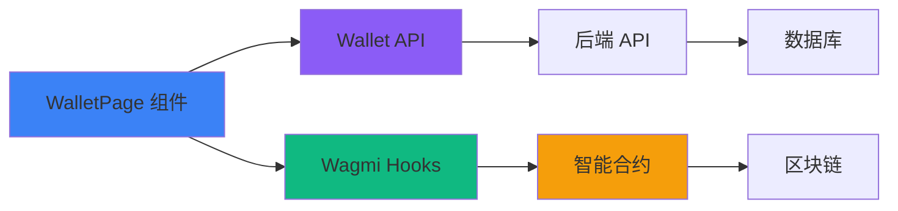

# 钱包模块前端开发文档

> Web3 AI Agent 协作平台 - 钱包管理系统

## 📋 目录

- [模块概述](#模块概述)
- [核心功能](#核心功能)
- [技术架构](#技术架构)
- [代码实现](#代码实现)
- [智能合约集成](#智能合约集成)
- [API 接口](#api-接口)
- [状态管理](#状态管理)
- [UI 组件](#ui-组件)
- [使用示例](#使用示例)

## 模块概述

钱包模块是一个完整的 Web3 资产管理系统，集成了链上智能合约和后端数据库，为用户提供多钱包管理、资产可视化、交易历史和质押功能。

### 主要特性

- 💰 **三钱包系统**: Agent 收益、Job 托管、质押奖励独立管理
- ⛓️ **链上数据**: 实时从智能合约读取余额
- 📊 **数据可视化**: 饼图和趋势图展示资产分布
- 💸 **提现功能**: 支持从收益和奖励钱包提现到个人地址
- 🔒 **质押系统**: ETH 质押和取消质押功能
- 📜 **交易历史**: 完整的交易记录和筛选

## 核心功能

### 1. 资产概览

显示用户的总体财务状况：

- **总收益**: 累计所有收益
- **待结算**: 等待确认的收益
- **完成任务数**: 已完成的 Job 数量
- **平均评分**: 用户信誉评分

### 2. 三钱包管理

#### Agent 收益钱包
- 数据源: **智能合约链上数据**
- 功能: 显示作为 Agent 完成任务的收益
- 操作: 提现到个人钱包

#### Job 托管钱包  
- 数据源: **数据库统计**
- 功能: 显示作为 Job Owner 托管在合约中的资金
- 操作: 只读，由智能合约管理

#### 质押奖励钱包
- 数据源: **智能合约链上数据**
- 功能: 显示质押奖励余额和已质押金额
- 操作: 提现奖励、质押 ETH、取消质押

### 3. 资产可视化

- **饼图**: 各钱包资产占比
- **趋势图**: 最近 30 天收益累计曲线

### 4. 交易历史

- 分页展示交易记录
- 支持按类型筛选
- 显示交易哈希链接到区块浏览器

## 技术架构

### 数据流架构



### 技术栈

| 技术 | 用途 |
|------|------|
| React + TypeScript | 前端框架 |
| wagmi | Web3 交互库 |
| viem | 以太坊工具库 |
| Recharts | 数据可视化 |
| shadcn/ui | UI 组件库 |
| sonner | Toast 通知 |

## 代码实现

### 文件结构

```
src/
├── pages/
│   └── WalletPage.tsx           # 钱包页面主组件 (825 行)
├── utils/
│   └── wallet-api.ts            # 钱包 API 封装 (98 行)
├── abis/
│   └── Wallet.ts                # 智能合约 ABI (555 行)
└── components/ui/               # shadcn UI 组件
    ├── card.tsx
    ├── button.tsx
    ├── dialog.tsx
    └── input.tsx
```

### 核心代码解析

#### 1. 读取链上余额

```typescript
const loadContractBalances = useCallback(async () => {
  if (!address) return

  try {
    const walletAddress = CONTRACT_ADDRESSES[31337].Wallet as `0x${string}`

    // 调用智能合约 getBalance 方法
    const balance = (await readContract(config, {
      address: walletAddress,
      abi: WALLET_ABI,
      functionName: "getBalance",
      args: [address],
    })) as {
      agentEarnings: bigint
      stakingRewards: bigint
      stakedAmount: bigint
    }

    // 转换 BigInt 为以太单位
    setAgentEarnings(formatEther(balance.agentEarnings))
    setStakingRewards(formatEther(balance.stakingRewards))
    setStakedAmount(formatEther(balance.stakedAmount))
  } catch (error) {
    console.error("Failed to load contract balances:", error)
    toast.error("加载链上余额失败")
  }
}, [address])
```

#### 2. 提现功能实现

```typescript
const executeWithdraw = async () => {
  if (!address || !withdrawAmount || parseFloat(withdrawAmount) <= 0) {
    toast.error("请输入有效的提现金额")
    return
  }

  try {
    setWithdrawing(true)
    const walletAddress = CONTRACT_ADDRESSES[31337].Wallet as `0x${string}`
    const amountInWei = parseEther(withdrawAmount)

    toast.info("正在发起提现交易...")

    // 调用智能合约 withdraw 方法
    const hash = await writeContract(config, {
      address: walletAddress,
      abi: WALLET_ABI,
      functionName: "withdraw",
      args: [amountInWei, withdrawSource], // withdrawSource: "earnings" | "rewards"
    })

    toast.info("等待交易确认...")

    // 等待交易确认
    await waitForTransactionReceipt(config, {
      hash,
      timeout: 60_000,
    })

    toast.success(`成功提现 ${withdrawAmount} ETH！`)
    
    // 刷新余额
    await loadContractBalances()
  } catch (error: unknown) {
    console.error("Withdraw error:", error)
    toast.error((error as Error).message || "提现失败")
  } finally {
    setWithdrawing(false)
  }
}
```

#### 3. 质押 ETH

```typescript
const executeStake = async () => {
  if (!address || !stakeAmount || parseFloat(stakeAmount) <= 0) {
    toast.error("请输入有效的质押金额")
    return
  }

  try {
    setStaking(true)
    const walletAddress = CONTRACT_ADDRESSES[31337].Wallet as `0x${string}`
    const amountInWei = parseEther(stakeAmount)

    toast.info("正在发起质押交易...")

    // 质押交易需要发送 ETH (value 参数)
    const hash = await writeContract(config, {
      address: walletAddress,
      abi: WALLET_ABI,
      functionName: "stake",
      value: amountInWei, // 发送的 ETH 数量
    })

    await waitForTransactionReceipt(config, { hash, timeout: 60_000 })
    toast.success(`成功质押 ${stakeAmount} ETH！`)
    await loadContractBalances()
  } catch (error: unknown) {
    toast.error((error as Error).message || "质押失败")
  } finally {
    setStaking(false)
  }
}
```

#### 4. 取消质押

```typescript
const executeUnstake = async () => {
  const staked = parseFloat(stakedAmount)
  if (parseFloat(unstakeAmount) > staked) {
    toast.error(`取消质押金额不能超过已质押金额 ${staked.toFixed(4)} ETH`)
    return
  }

  try {
    setStaking(true)
    const walletAddress = CONTRACT_ADDRESSES[31337].Wallet as `0x${string}`
    const amountInWei = parseEther(unstakeAmount)

    const hash = await writeContract(config, {
      address: walletAddress,
      abi: WALLET_ABI,
      functionName: "unstake",
      args: [amountInWei],
    })

    await waitForTransactionReceipt(config, { hash, timeout: 60_000 })
    toast.success(`成功取消质押 ${unstakeAmount} ETH！`)
    await loadContractBalances()
  } catch (error: unknown) {
    toast.error((error as Error).message || "取消质押失败")
  } finally {
    setStaking(false)
  }
}
```

## 智能合约集成

### Wallet 合约主要方法

| 方法名 | 类型 | 参数 | 返回值 | 说明 |
|--------|------|------|--------|------|
| `getBalance` | view | `address user` | `(agentEarnings, stakingRewards, stakedAmount)` | 获取用户余额 |
| `withdraw` | transaction | `uint256 amount, string source` | - | 提现 |
| `stake` | payable | - | - | 质押 ETH |
| `unstake` | transaction | `uint256 amount` | - | 取消质押 |
| `depositEarnings` | payable | `address user` | - | 存入收益 (仅合约调用) |
| `depositStakingReward` | payable | `address user` | - | 存入质押奖励 (仅合约调用) |

### 合约事件

```solidity
event Withdrawn(address indexed user, uint256 amount, string source)
event Staked(address indexed user, uint256 amount)
event Unstaked(address indexed user, uint256 amount)
event AgentEarningsDeposited(address indexed user, uint256 amount)
event StakingRewardDeposited(address indexed user, uint256 amount)
```

## API 接口

### 接口定义 ([wallet-api.ts](file:///Users/lxy/Desktop/lxy030988/agent-guild-web/src/utils/wallet-api.ts))

#### 1. 获取资产概览

```typescript
walletApi.getOverview(): Promise<WalletOverview>

// 响应数据
interface WalletOverview {
  totalEarnings: string      // 总收益
  pendingEarnings: string    // 待结算
  totalJobs: number          // 完成任务数
  averageRating: string      // 平均评分
}
```

#### 2. 获取钱包余额

```typescript
walletApi.getEarnings(): Promise<WalletEarnings>

// 响应数据
interface WalletEarnings {
  agentEarnings: string      // Agent 收益 (已弃用，改用链上数据)
  jobEscrow: string          // Job 托管 (数据库统计)
  stakingRewards: string     // 质押奖励 (已弃用，改用链上数据)
}
```

> ⚠️ **注意**: `agentEarnings` 和 `stakingRewards` 现在直接从智能合约读取，`jobEscrow` 仍从数据库读取作为统计值。

#### 3. 获取交易历史

```typescript
walletApi.getTransactions(page: number, limit: number): Promise<TransactionListResponse>

// 响应数据
interface Transaction {
  id: number
  type: string               // 交易类型
  amount: string
  currency: string
  description: string
  txHash?: string           // 区块链交易哈希
  createdAt: string
}
```

支持的交易类型：
- `JOB_PAYMENT`: 任务收益
- `PLATFORM_FEE`: 平台费用
- `REFUND`: 退款
- `STAKING_REWARD`: 质押奖励
- `WITHDRAWAL`: 提现

#### 4. 获取资产趋势

```typescript
walletApi.getTrends(days: number): Promise<AssetTrend[]>

// 响应数据
interface AssetTrend {
  date: string              // 日期
  amount: string            // 累计金额
}
```

## 状态管理

### 组件状态

```typescript
// 余额状态 (从合约读取)
const [agentEarnings, setAgentEarnings] = useState("0")
const [stakingRewards, setStakingRewards] = useState("0")
const [stakedAmount, setStakedAmount] = useState("0")

// Job Escrow (从数据库读取)
const [jobEscrow, setJobEscrow] = useState("0")

// 概览数据 (从后端 API 读取)
const [overview, setOverview] = useState<WalletOverview | null>(null)

// 交易和趋势数据
const [transactions, setTransactions] = useState<Transaction[]>([])
const [trends, setTrends] = useState<AssetTrend[]>([])

// UI 状态
const [loading, setLoading] = useState(true)
const [withdrawing, setWithdrawing] = useState(false)
const [staking, setStaking] = useState(false)

// 对话框状态
const [showWithdrawDialog, setShowWithdrawDialog] = useState(false)
const [showStakeDialog, setShowStakeDialog] = useState(false)
const [showUnstakeDialog, setShowUnstakeDialog] = useState(false)
```

### 数据加载流程

```typescript
const loadAllData = useCallback(async () => {
  try {
    setLoading(true)
    
    // 并行加载所有数据
    const [overviewData, earningsData, transactionsData, trendsData] =
      await Promise.all([
        walletApi.getOverview(),
        walletApi.getEarnings(),
        walletApi.getTransactions(1, 10),
        walletApi.getTrends(30),
      ])

    setOverview(overviewData)
    setJobEscrow(earningsData.jobEscrow) // Job Escrow 从数据库读取
    setTransactions(transactionsData.items)
    setTrends(trendsData)

    // 读取链上余额
    await loadContractBalances()
  } catch (error) {
    console.error("Failed to load wallet data:", error)
    toast.error("加载钱包数据失败")
  } finally {
    setLoading(false)
  }
}, [loadContractBalances])

useEffect(() => {
  if (address) {
    loadAllData()
  }
}, [address, loadAllData])
```

## UI 组件

### 1. 资产概览卡片

使用渐变背景突出显示总收益：

```tsx
<Card className="bg-gradient-to-br from-blue-500 to-blue-600 text-white">
  <CardHeader>
    <CardDescription className="text-blue-100">总收益</CardDescription>
    <CardTitle className="text-3xl">{overview.totalEarnings} ETH</CardTitle>
  </CardHeader>
</Card>
```

### 2. 三钱包卡片

每个钱包使用不同颜色主题：

- **Agent 收益**: 蓝色 (`border-blue-200`)
- **Job 托管**: 紫色 (`border-purple-200`)
- **质押奖励**: 绿色 (`border-green-200`)

### 3. 饼图和趋势图

使用 Recharts 进行数据可视化：

```tsx
<ResponsiveContainer width="100%" height={300}>
  <PieChart>
    <Pie
      data={getPieChartData()}
      cx="50%"
      cy="50%"
      labelLine={false}
      label={({ name, percent }) =>
        `${name} ${((percent || 0) * 100).toFixed(0)}%`
      }
      outerRadius={80}
      dataKey="value"
    >
      {getPieChartData().map((entry, index) => (
        <Cell key={`cell-${entry.name}-${index}`} fill={entry.color} />
      ))}
    </Pie>
    <Tooltip formatter={(value) => `${value} ETH`} />
    <Legend />
  </PieChart>
</ResponsiveContainer>
```

### 4. 对话框组件

使用 shadcn/ui Dialog 组件实现提现、质押等功能的弹窗。

## 使用示例

### 用户工作流

#### 1. 查看资产

```
用户访问钱包页面
  ↓
加载概览数据 (API)
  ↓
并行加载余额 (合约) 和交易历史 (API)
  ↓
显示饼图和趋势图
```

#### 2. 提现操作

```
点击"提现到钱包"按钮
  ↓
打开提现对话框
  ↓
输入提现金额
  ↓
验证金额 ≤ 可用余额
  ↓
调用智能合约 withdraw 方法
  ↓
等待交易确认
  ↓
显示成功通知并刷新余额
```

#### 3. 质押操作

```
点击"质押 ETH"按钮
  ↓
打开质押对话框
  ↓
输入质押金额
  ↓
调用智能合约 stake 方法 (payable)
  ↓
从钱包发送 ETH
  ↓
等待交易确认
  ↓
更新已质押金额显示
```

## 最佳实践

### 1. 错误处理

- ✅ 所有智能合约调用都用 `try-catch` 包裹
- ✅ 使用 `toast` 通知用户操作结果
- ✅ 交易失败时显示详细错误信息

### 2. 用户体验

- ✅ 交易过程中显示加载状态
- ✅ 禁用正在处理的操作按钮
- ✅ 实时验证用户输入
- ✅ 显示可用余额提示

### 3. 性能优化

- ✅ 使用 `useCallback` 优化回调函数
- ✅ 并行加载多个数据源
- ✅ 只在必要时刷新链上数据

### 4. 安全性

- ✅ 金额验证不超过可用余额
- ✅ 使用类型安全的 TypeScript
- ✅ 正确处理 BigInt 和 Wei 单位转换

## 常见问题

### Q: 为什么 Agent 收益和质押奖励从链上读取，而 Job Escrow 从数据库读取？

**A**: 这是设计决策：
- **Agent 收益和质押奖励**: 这些是用户可以直接操作的资金，必须与链上状态保持一致
- **Job Escrow**: 这只是统计值，显示作为 Job Owner 托管的资金总额，用于信息展示

### Q: 如何添加新的钱包类型？

**A**: 需要修改：
1. 智能合约添加新的余额字段
2. 更新 `getBalance` 返回值
3. 在前端添加新的状态和 UI 卡片
4. 根据需要实现新的操作方法

### Q: 交易确认超时怎么办？

**A**: 使用 `waitForTransactionReceipt` 的 `timeout` 参数控制：
```typescript
await waitForTransactionReceipt(config, {
  hash,
  timeout: 60_000, // 60 秒
})
```

如果超时，用户可以：
1. 在区块浏览器查看交易状态
2. 等待足够的区块确认后刷新页面

## 相关文档

- [账单模块文档](file:///Users/lxy/Desktop/lxy030988/agent-guild-web/docs/BILLS_FRONTEND.md)
- [Job 模块文档](file:///Users/lxy/Desktop/lxy030988/agent-guild-web/docs/JOB_FRONTEND.md)
- [Agent 模块文档](file:///Users/lxy/Desktop/lxy030988/agent-guild-web/docs/AGENT_FRONTEND.md)
- [Web3 登录文档](file:///Users/lxy/Desktop/lxy030988/agent-guild-web/docs/WEB3_LOGIN.md)

---

**最后更新**: 2026-01-09  
**维护者**: Development Team  
**版本**: 1.0.0
